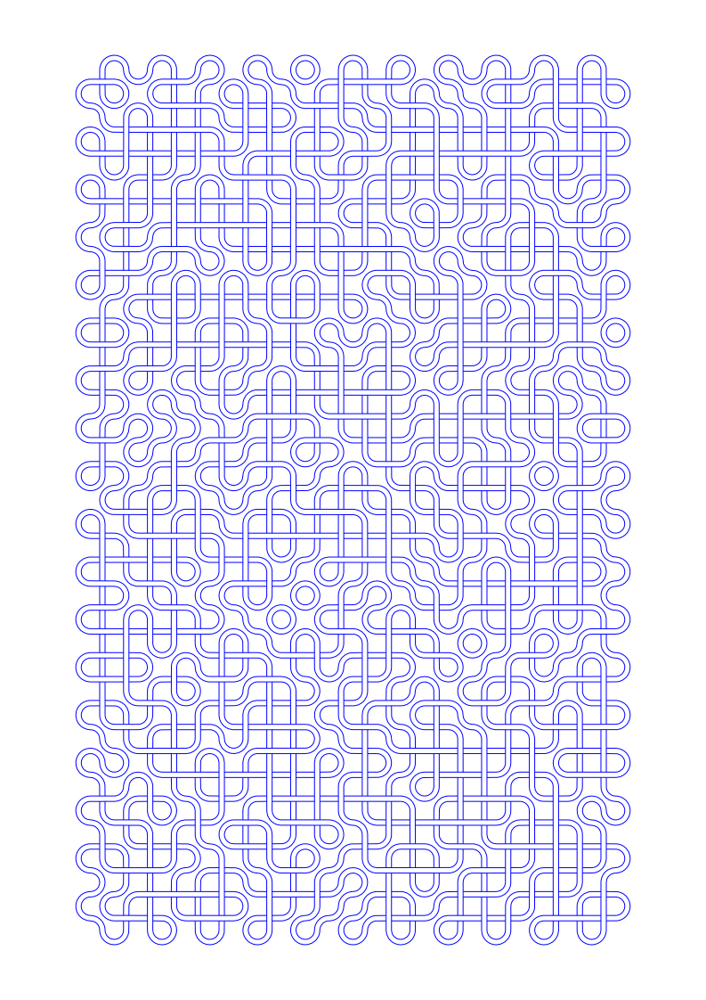

# putti-plotter-plot
Experiments with pen plotter.

Initial idea is to use vsketch for plotting, with the power of numpy, scipy and shapely behind it to draw cool shit.

### Rockets:

### Random walk:

### Truchet tiles:

### Maps:

